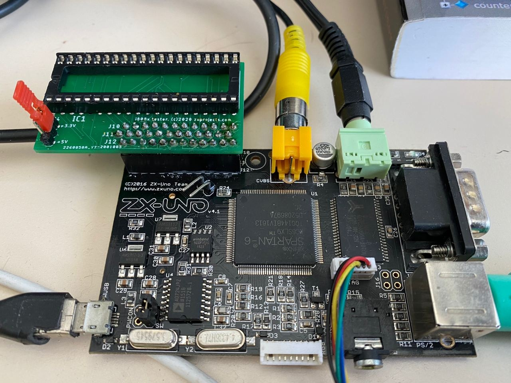
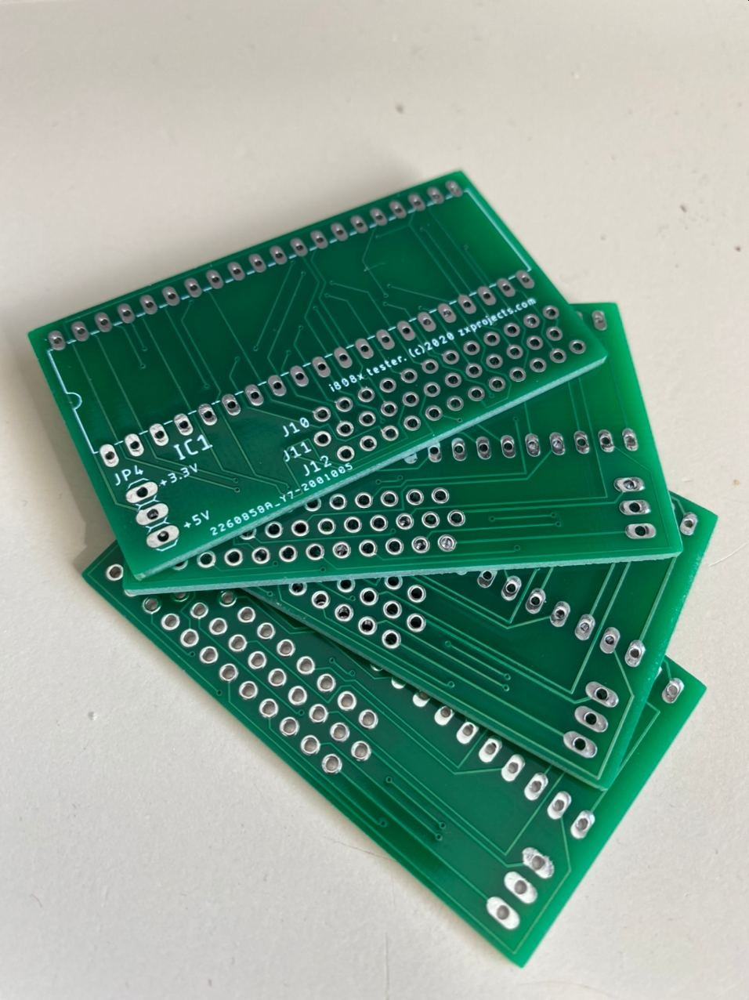
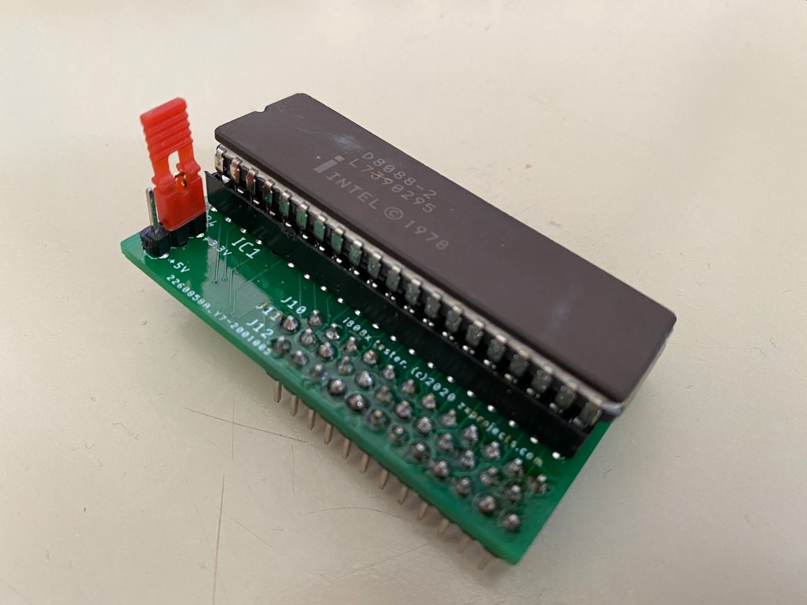

# i8088_tester
A small core and board to test Intel 8088 chips for minimal functionality. It is designed for the ZXUNO board, which in turn is based upon a Spartan 6 LX9 FPGA.

The board has the option to power the i8088 chip with either 3.3V or 5V. In the later case, be aware that the chip will be directly connected to the FPGA, so the test should be as short as possible to avoid permanent damage to the FPGA GPIOs (yes, I know it's not the proper way to do this).

The FPGA core defines a small 16 byte ROM, which disables interrupts, turn on the LED and jumps to RAM. The code in RAM just loops forever toggling the state of the LED at a rate of approx. 4 times per second.
